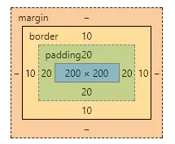

# CSS基本布局

## 添加样式

关于 CSS3 可以查阅 [w3c的简介](http://www.w3school.com.cn/css/css_jianjie.asp) 

> 样式表定义如何显示 HTML 元素，就像 HTML 3.2 的字体标签和颜色属性所起的作用那样。样式通常保存在外部的 .css 文件中。通过仅仅编辑一个简单的 CSS 文档，外部样式表使你有能力同时改变站点中所有页面的布局和外观。

> 由于允许同时控制多重页面的样式和布局，CSS 可以称得上 WEB 设计领域的一个突破。作为网站开发者，你能够为每个 HTML 元素定义样式，并将之应用于你希望的任意多的页面中。如需进行全局的更新，只需简单地改变样式，然后网站中的所有元素均会自动地更新。

CSS 规则由两个主要的部分构成：选择器，以及一条或多条声明。

选择器通常是需要改变样式的 HTML 元素。
每条声明由一个属性和一个值组成。
属性（property）是您希望设置的样式属性（style attribute）。每个属性有一个值。属性和值被冒号分开。

如果要定义不止一个声明，则需要用分号将每个声明分开。


CSS 选择器有很多种，比如派生选择器，id 选择器，类选择器等等。派生选择器
通过依据元素在其位置的上下文关系来定义样式，比如 li 标签里的 strong 元素，可以这样表示：

```css
li strong {
    font-style: italic;
}
```

id 选择器可以为标有特定 id 的 HTML 元素指定特定的样式。
id 选择器以 "#" 来定义。

类选择器以'.'显示。

## CSS 布局

给网页添加样式时，先考虑布局，再优化细节。

### 盒模型

盒模型是CSS的核心。打开浏览器，右键检查，可以看到网页源码在内的一些具体信息，选中一个元素，就可以看到一个多个矩形嵌套的矩形，这就是盒模型。

打开Chrome浏览器，f12，选择一个元素拉到最下方，就可以看到这样一个盒子：



这个盒子的代码是这样的：

```css
.box{
        width:200px;
        height:200px;
        padding:20px;
        border:10px solid black;
}
```

对盒模型的详细介绍： https://juejin.im/post/59ef72f5f265da4320026f76

### 相对布局、绝对布局和 flex 布局

网页布局有好几种形式，比较常见的有relative相对布局，absolute绝对布局和flex布局, 对应position 的不同属性值。

```css
position: static;
position: relative;
position: absolute;
position: fixed;
```

#### 相对布局

相对布局，即relative，就是像水流一样排布下来的布局。这个布局也是网页设计最基础的布局。

#### 绝对布局

绝对布局是不受相对位置影响的。
绝对布局一般在局部使用，我们一般不会在网页的整体布局里使用绝对布局。


#### flex 布局

关于 flex 布局：http://www.ruanyifeng.com/blog/2015/07/flex-grammar.html


```css
#content {
    display: flex;
    direction: row;
}
```

float 浮动布局可以用于文字包围图片的排版。

fixed 用于元素相对于视口固定的情况。
