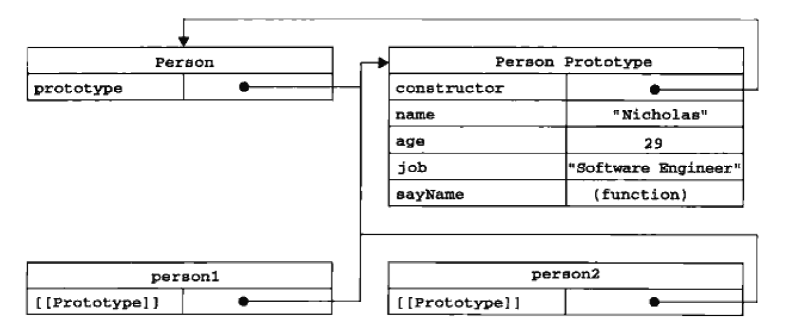
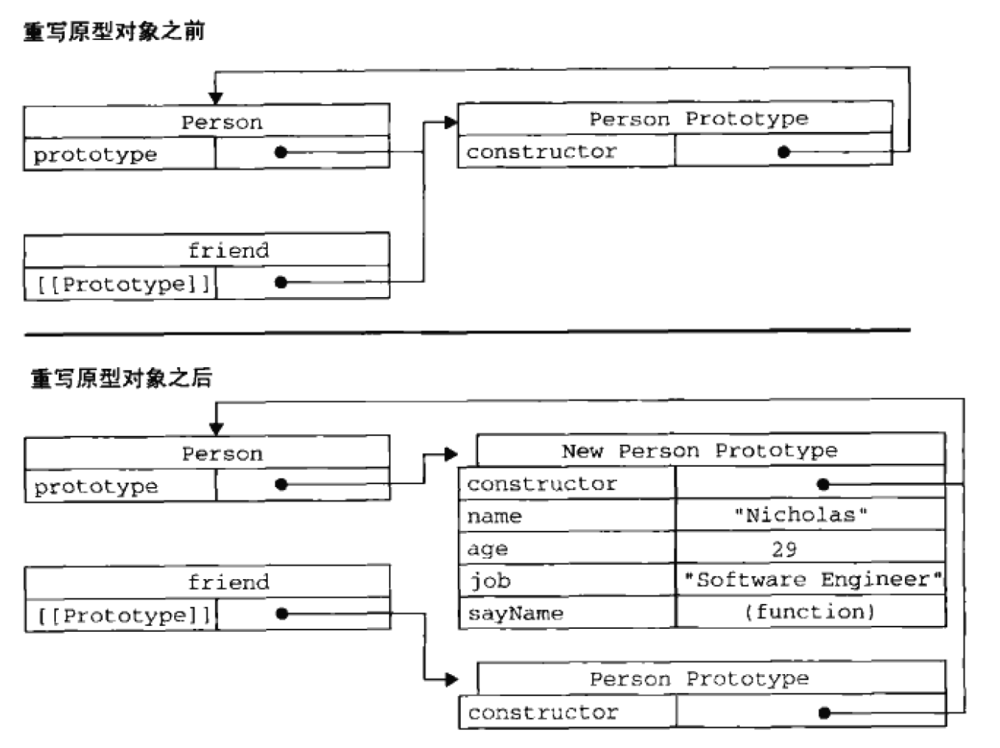

# 原型模式

## 大纲
- 理解原型
    - 创建函数后，函数创建一个prototype属性，属性指向原型对象，属性里有一个constructor指针，指向prototype属性所在的函数
    - 原型对象的属性和方法为其所有实例共享
- 检测原型
    - Object.prototype.isPrototypeOf()检查某实例的原型
    - Object.getPrototypeOf()获取对象的原型
- 对象的属性
    - 实例对象可以改写原型属性，不改变原型的属性
    - delete删除实例对象的属性，可以恢复访问原型属性
    - hasOwnProperty()检测属性是实例对象还是原型对象的
    - in检测对象是否具有某种属性
- 获取属性
    - for-in 循环返回对象可枚举的属性 enumerable，包括实例和原型属性
    - Object.keys()获取可枚举的属性
    - Object.getOwnPropertyNames()获取所有属性
- 原型属性
    - 使用对象字面量重写原型属性
    - 原型的属性可以添加和修改，但重写属性会切断原型和之前已有的实例之间的关系
- 问题：引用类型的共享


## 详细版

- 创建函数后，函数创建一个prototype属性，属性指向原型对象，属性里有一个constructor指针，指向prototype属性所在的函数


```js
function aaa(){
}

aaa.prototype;
// {constructor: ƒ}
//     constructor: ƒ aaa()
//     __proto__: Object

aaa.prototype.constructor;
// ƒ aaa(){
// }
```




```js
function Person(){
}

Person.prototype.name = "Nicolas";
Person.prototype.age = 29;
Person.prototype.sayName = function() {
    alert(this.name);
}

Person.prototype.constructor;
// ƒ Person(){
// }

person1.constructor;
// ƒ Person(){
// }
```
- 检查某实例的原型

```js
alert(Person.prototype.isPrototypeOf(person1));
// true
```
- 获取对象的原型

```js
Object.getPrototypeOf(person1);
// {name: "Nicolas", age: 29, sayName: ƒ, constructor: ƒ}

Object.getPrototypeOf(person1).name;
// "Nicolas"
```


- 原型对象的属性和方法为其所有实例共享

```js
function Person(){
}

Person.prototype.name = "Nicolas";
Person.prototype.age = 29;
Person.prototype.sayName = function() {
    alert(this.name);
}

var person1 = new Person();

Person.prototype.constructor;
// ƒ Person(){
// }

person1.constructor;
// ƒ Person(){
// }
```

- 实例对象可以改写原型属性，不改变原型的属性
- delete删除实例对象的属性，可以恢复访问原型属性

```js
function Person(){
}

Person.prototype.name = "Nicolas";
Person.prototype.age = 29;
Person.prototype.sayName = function() {
    alert(this.name);
}

var person1 = new Person();

person1.name;
// "Nicolas" // 来自原型

person1.name = "Greg";
// "Greg"

// 删除实例对象的属性
delete person1.name;

person1.name;
// "Nicolas" // 来自原型
```

- hasOwnProperty()检测属性是实例对象还是原型对象的
- in检测对象是否具有某种属性

```js
person1.hasOwnProperty("name");
// false // 原型对象的属性返回false

"name" in person1;
// true
```

- for-in 循环返回对象可枚举的属性 enumerable，包括实例和原型属性

- Object.keys()获取可枚举的属性

```js
function Person(){
}

Person.prototype.name = "Nicolas";
Person.prototype.age = 29;
Person.prototype.sayName = function() {
    alert(this.name);
}

var person1 = new Person();

Object.keys(Person.prototype);
// ["name", "age", "sayName"]

Object.keys(person1);
// []

person1.name = "Wheatley"; 
person1.age = 23;

Object.keys(person1);
// ["name", "age"]
```

- Object.getOwnPropertyNames()获取所有属性

```js
Object.getOwnPropertyNames(person1);
// ["name", "age"]

Object.getOwnPropertyNames(Person.prototype);
// ["constructor", "name", "age", "sayName"]
```

- 使用对象字面量重写原型属性


```js
function Person(){
}

Person.prototype = {
    constructor: Person,
    name: "Nicolas",
    age: 29,
    sayName: function() {
        alert(this.name);
    }
// 此时会将constructor的enumerable属性设置为true

Object.defineProperty(Person.prototype, "constructor",{
    enumerable: false,
    value: Person,
});
}; 
```

- 原型的属性可以添加和修改，但重写属性会切断原型和之前已有的实例之间的关系



- 问题：引用类型的共享


