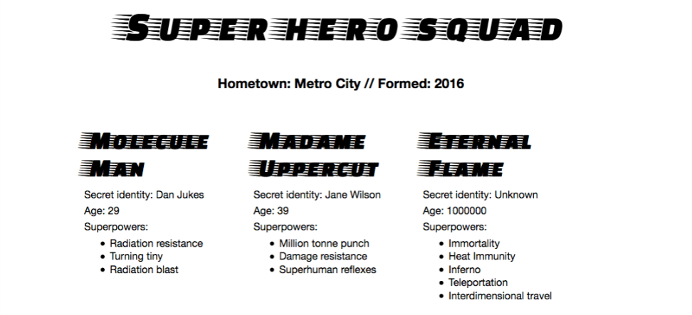

# 使用 JSON

[仓库地址](https://github.com/noirlyrik/webprojects/tree/master/superHero)

效果图:



[JSON 数据](https://github.com/noirlyrik/webprojects/blob/master/superHero/superHero.json)

```json
{
    "squadName" : "Super Hero Squad",
    "homeTown" : "Metro City",
    "formed" : 2016,
    "secretBase" : "Super tower",
    "active" : true,
    
    "members" : [
      {
        "name" : "Molecule Man",
        "age" : 29,
        "secretIdentity" : "Dan Jukes",
        "powers" : [
          "Radiation resistance",
          "Turning tiny",
          "Radiation blast"
        ]
      },
    ... 
    ]
  }
```


## 使用本地 JSON 文件出现跨域问题

[参考资料](https://github.com/endRuz/Blog/issues/10)


> 使用 JQuery Ajax 加载不了本地 Json 文件。
> 
> 打开 DevTools(F12) 发现 Console 中报错：
> 
> jquery-3.3.1.js:9600 Access to XMLHttpRequest at 'file:///C:/Users/endru/GitRep/JavaScriptUtils/DataTables/data.json?_=1542954193429' from origin 'null' has been blocked by CORS policy: Cross origin requests are only supported for protocol schemes: http, data, chrome, chrome-extension, https.
> 
> ### Analysis
> 报错的大概意思是：
> 
> 跨源请求支持的协议有：http,data,chrome,chrome-extension,https。
> 
> 因为不支持file协议，所以我的跨域请求被 CORS(跨域资源共享) 政策拒绝了。
> 
> ### Solution
> 有以下三种思路来解决这个问题：
> 
> 1. 配置 Chrome 支持本地 file 协议的 ajax 请求。
> 
> 这种思路有两种方法：
> 
> - 利用 CMD 解决。
> 
> 关闭所有 Chrome 窗口后，打开 CMD cd 到 chrome.exe 所在文件夹 然后运行
> chrome.exe --allow-file-access-from-files
> 
> 然后在被打开的 Chrome 窗口内访问。
> 
> - 使用 Windows 快捷方式。
> 
> Windows 右击 Chrome 的快捷方式 属性 - 快捷方式 - 目标。
> 
> 将目标内容后添加--allow-file-access-from-files。
> 
> 注意添加的内容和原有内容要用空格分割。例如：
> "C:\Program Files (x86)\Google\Chrome\Application\chrome.exe" --allow-file-access-from-files。
> 
> 点击确定后，关闭所有 Chrome 窗口，使用快捷方式打开的 Chrome 窗口进行访问。
> 
>
> 2. 使用本地 Web Server 访问
> 
> 因为我使用 VScode 推荐大家使用 Live Server 插件。
> 
> 运行本地 Web Server 之后进行访问 ，本地 Json 地址变为
> http://127.0.0.1:5500/DataTables/data.json?_=1542964505300
> 变成 http 协议，且与请求页面同源。
> 
> 3. 使用跨域请求支持 file 协议的浏览器
> 比如，我们神奇的 Firefox。。。

Firefox 好像也不行了

## 使用 vue 

- v-for 遍历，无须手动操作 DOM 
- JSON 放在 data 里
- 数据：现有的数据结构不利于处理，将 headers 与 members 分开，section里的三个article需要遍历，使用 v-for 循环，headers 的数据放在前面不是很方便

[原有的 JSON 数据](https://github.com/noirlyrik/webprojects/blob/master/superHero/superHero.json)

```json
{
    "squadName" : "Super Hero Squad",
    "homeTown" : "Metro City",
    "formed" : 2016,
    "secretBase" : "Super tower",
    "active" : true,
    
    "members" : [
      {
        "name" : "Molecule Man",
        "age" : 29,
        "secretIdentity" : "Dan Jukes",
        "powers" : [
          "Radiation resistance",
          "Turning tiny",
          "Radiation blast"
        ]
      },
    ... 
    ]
  }
```

[调整后的数据](https://github.com/noirlyrik/webprojects/blob/master/superHero/vue-demo/main.js)


```json
 superHeroes: [
      {
        squadName: "Super Hero Squad",
        homeTown: "Metro City",
        formed: 2016,
        secretBase: "Super tower",
        active: true,
      },
    ],

    members: [
      {
        name: "Molecule Man",
        age: 29,
        secretIdentity: "Dan Jukes",
        powers: ["Radiation resistance", "Turning tiny", "Radiation blast"],
      },
      ...
    ]
```